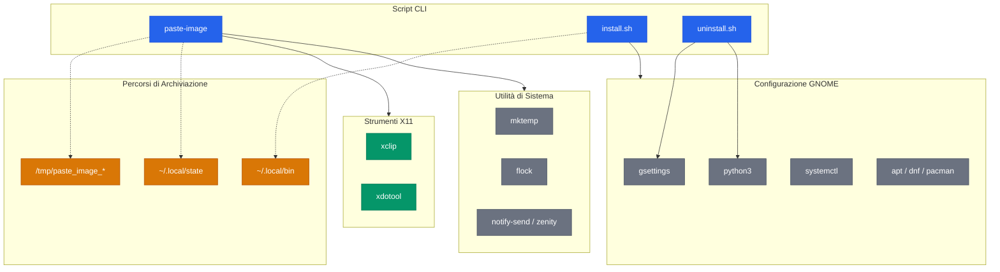
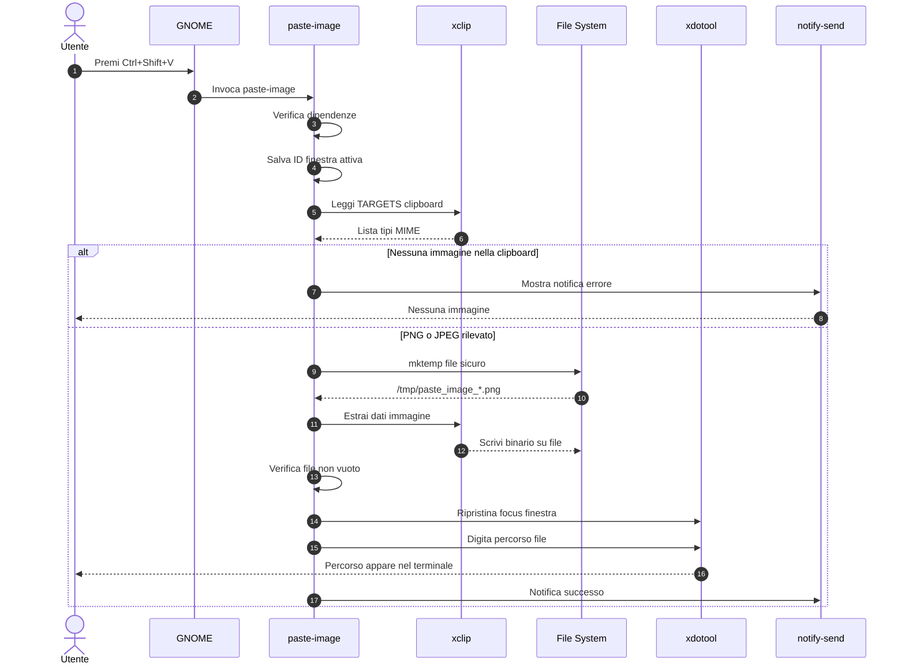

> **Lingua:** Italiano | [English](README.md)
>
> **Vedi anche:** [Politica di Sicurezza (IT)](SECURITY.it.md) · [Security Policy (EN)](SECURITY.md)

<div align="center">

[](https://github.com/AndreaBonn/cli-image-paste/actions/workflows/ci.yml)
[](https://github.com/koalaman/shellcheck)
[](LICENSE)
[](SECURITY.md)

</div>

# cli-image-paste

Incolla immagini dagli appunti direttamente nel terminale come percorsi file — pronto per qualsiasi assistente di coding da CLI.

Premi una scorciatoia da tastiera e l'immagine negli appunti viene salvata come file temporaneo, con il suo percorso digitato automaticamente nella finestra del terminale attivo.

## Perché

Gli assistenti di coding da CLI come [Claude Code](https://docs.anthropic.com/en/docs/claude-code), [Aider](https://aider.chat), [Gemini CLI](https://github.com/google-gemini/gemini-cli) e altri accettano file immagine come input, ma non hanno un modo nativo per incollare immagini dagli appunti di sistema. Questo tool colma quel vuoto: copia un'immagine, premi la scorciatoia e il percorso del file viene digitato nel terminale — pronto per l'invio.

Funziona con **qualsiasi tool CLI** che accetta percorsi file come input.

## Architettura



> Per diagrammi tecnici dettagliati (flusso installazione, pipeline CI/CD), vedi [docs/ARCHITECTURE.it.md](docs/ARCHITECTURE.it.md).

## Demo

```
# 1. Copia un'immagine (screenshot, immagine dal browser, ecc.)
# 2. Metti il focus sul terminale con il tuo assistente di coding
# 3. Premi Ctrl+Shift+V
# 4. Il percorso viene digitato automaticamente:

/tmp/paste_image_20260309_143022_a1b2c3.png
```

Il nome del file include un timestamp e un suffisso casuale generato da `mktemp` per sicurezza e unicità.

### Come funziona



## Funzionalità

- Funziona sia su **X11 sia su Wayland**, con rilevamento del display server a ogni avvio
- Scorciatoia da tastiera globale (configurabile)
- Legge PNG e JPEG direttamente, converte WebP, GIF, TIFF, BMP, AVIF e SVG
- Quando copi un **file** immagine dal file manager usa il percorso esistente invece di duplicarlo
- Backend di consegna scelto in base alla sessione: `xdotool`, `wtype`, `ydotool` o gli appunti
- Configurazione utente in `~/.config/paste-image/config`, che sopravvive agli aggiornamenti
- Creazione atomica e sicura dei file tramite `mktemp` con permessi `0600`
- Percorsi validati prima della digitazione: caratteri di controllo e override bidirezionali vengono rifiutati
- ImageMagick gira con una policy restrittiva dedicata e limiti di risorsa
- Notifiche desktop per successo ed errori (con fallback su zenity)
- Pulizia automatica dei file temporanei più vecchi di 7 giorni
- Rotazione dei log con scritture protette da `flock`
- Installazione delle dipendenze multi-distro (apt/dnf/pacman)
- Suite di 145 test, ShellCheck pulito, gate eseguibili su dimensione e purezza dei moduli


## Requisiti di Sistema

| Requisito                | Dettaglio                                                    |
| ------------------------ | ------------------------------------------------------------ |
| **Sistema operativo**    | Linux                                                        |
| **Display server**       | X11 oppure Wayland                                           |
| **Ambiente desktop**     | GNOME per la configurazione automatica, gli altri a mano     |
| **Shell**                | Bash 4.4+                                                    |

**Formati letti direttamente:** PNG, JPEG.
**Convertiti se ImageMagick è installato:** WebP, GIF, TIFF, BMP, AVIF.
**Convertito se rsvg-convert è installato:** SVG.

## Supporto Wayland

Leggere gli appunti funziona ovunque. Digitare il percorso no: dipende da cosa
implementa il compositore, e non esiste un modo per chiederglielo in anticipo.

| Sessione | Compositore           | Come arriva il percorso                        |
| -------- | --------------------- | ---------------------------------------------- |
| X11      | qualunque             | digitato tramite `xdotool`                     |
| Wayland  | sway, Hyprland, river | digitato tramite `wtype`                       |
| Wayland  | GNOME, Unity          | **copiato negli appunti**, premi tu Ctrl+V     |
| Wayland  | KDE, altri            | `wtype` se funziona, altrimenti gli appunti    |

Su GNOME Wayland gli appunti sono il comportamento predefinito, non un ripiego
dopo un fallimento. Mutter non implementa il protocollo
`virtual-keyboard-unstable-v1` richiesto da `wtype`, e un ripiego si
scoprirebbe solo fallendo dopo che il file è già stato scritto: dal punto di
vista di chi preme la scorciatoia sembrerebbe che non sia successo nulla. Una
notifica avvisa che il percorso è pronto da incollare.

### A proposito di ydotool

`ydotool` sa digitare su qualunque compositore, quindi è disponibile impostando
`TYPING_BACKEND=ydotool` nel file di configurazione. Non viene mai scelto
automaticamente, ed è una scelta deliberata.

`ydotool` richiede un daemon con accesso a `/dev/uinput`. Chi riesce a
raggiungere quel daemon può iniettare tasti in **qualunque** applicazione della
sessione, compresi i prompt di sudo e le finestre dei gestori di password.
Questo annulla l'isolamento dell'input, che è il principale miglioramento di
sicurezza di Wayland rispetto a X11. Se lo attivi, verifica che il suo socket
sia accessibile al solo proprietario, e preferisci un daemon per utente
all'aggiunta del tuo account a un gruppo di sistema.


## Installazione

```bash
git clone https://github.com/user/cli-image-paste.git
cd cli-image-paste
bash install.sh
```

L'installer gestisce tutto:

1. Rileva e installa le dipendenze mancanti (`xclip`, `xdotool`, `libnotify-bin`)
2. Copia lo script in `~/.local/bin/paste-image`
3. Aggiunge `~/.local/bin` al PATH se necessario
4. Configura una scorciatoia da tastiera globale GNOME (default: `Ctrl+Shift+V`)
5. Verifica che il servizio `gsd-media-keys` sia attivo

Ti verrà chiesto di scegliere una scorciatoia personalizzata o accettare quella predefinita.

### Dipendenze

| Dipendenza      | Scopo                                       | Necessaria   |
| --------------- | ------------------------------------------- | ------------ |
| `xclip`         | Legge gli appunti su X11                    | su X11       |
| `wl-clipboard`  | Legge gli appunti su Wayland                | su Wayland   |
| `xdotool`       | Digita il percorso su X11                   | consigliata  |
| `wtype`         | Digita il percorso sui compositori wlroots  | opzionale    |
| `imagemagick`   | Converte WebP, GIF, TIFF, BMP, AVIF         | opzionale    |
| `librsvg2-bin`  | Converte gli SVG (`rsvg-convert`)           | opzionale    |
| `notify-send`   | Notifiche desktop                           | consigliata  |
| `python3`       | Manipolazione config JSON in installazione  | solo GNOME   |

Le dipendenze opzionali degradano con un messaggio che nomina il pacchetto da
installare, non bloccano mai lo strumento.

```bash
# Ubuntu/Debian
sudo apt install xclip xdotool libnotify-bin

# Fedora
sudo dnf install xclip xdotool libnotify

# Arch
sudo pacman -S xclip xdotool libnotify
```

## Utilizzo

### Tramite scorciatoia da tastiera (consigliato)

1. **Copia un'immagine** negli appunti (screenshot, tasto destro > copia immagine, ecc.)
2. **Metti il focus sul terminale** dove è in esecuzione il tuo assistente di coding
3. **Premi la scorciatoia** (default: `Ctrl+Shift+V`)
4. L'immagine viene salvata e il suo percorso digitato nel terminale
5. **Premi Invio** per inviarla all'assistente di coding

Il formato dell'output si adatta all'assistente in esecuzione nel terminale:
percorso nudo per Claude Code, `/add <percorso>` per Aider, `@<percorso>` per
Gemini CLI. Il rilevamento scende nell'albero dei processi della finestra
attiva, quindi funziona solo su X11; altrove, e per qualunque programma fuori
dall'elenco, viene usato il percorso nudo, che è sempre incollabile.
Impostare `FORMAT_TEMPLATE` nella configurazione ha la precedenza sul
rilevamento.

### Annotare prima di consegnare

```bash
paste-image --annotate
paste-image --screenshot --annotate
```

Apre satty o swappy per indicare la cosa di cui stai parlando, oppure per
oscurare quello che non deve lasciare la tua macchina. Viene eseguito per
ultimo, dopo l'eventuale ridimensionamento, perché le annotazioni applicate
prima di una riduzione risultano illeggibili.

Chiudere l'editor senza salvare consegna l'originale: è una decisione, non un
fallimento. Chiedere `--annotate` senza avere nessuno dei due strumenti è
invece un errore, perché ignorare in silenzio un flag appena scritto è
peggio che dire no.

### Diagnostica

```bash
paste-image --doctor
```

Stampa la sessione e il desktop rilevati, quale backend di consegna è stato
scelto, quali strumenti sono presenti, e gli eventuali backend esclusi dopo
un fallimento. Vale la pena allegarlo a una segnalazione: il comportamento
dipende dall'ambiente in modi che da fuori non si vedono.

### Riconsegnare l'ultima immagine

```bash
paste-image --last      # la più recente
paste-image --last 3    # la terzultima
```

La consegna tramite gli appunti sovrascrive gli appunti stessi, e questo
distrugge l'immagine di partenza: un secondo tentativo richiederebbe
altrimenti di rifare lo screenshot. Il file è ancora su disco, e questo
serve a riconsegnarlo. Se nel frattempo l'immagine è stata rimossa dalla
pulizia automatica, viene detto, invece di digitare un percorso morto.

### Catturare direttamente uno screenshot

```bash
paste-image --screenshot
```

Seleziona un'area, la salva e consegna il percorso in un solo passaggio,
saltando il giro da copia e incolla. Associato a una seconda scorciatoia
diventa il modo più rapido di mostrare qualcosa a un assistente.

Lo strumento di cattura viene scelto in base all'ambiente:
`gnome-screenshot` su GNOME, `spectacle` su KDE, `grim` con `slurp` sui
compositori wlroots, con ripiego su `flameshot`, `maim`, `scrot` o `import`.
Annullare la selezione è trattato come una decisione, non come un errore:
non viene scritto nulla e non compare alcun messaggio di fallimento.

### Invocazione manuale

```bash
paste-image            # Esegui lo script direttamente
paste-image --version  # Mostra la versione
paste-image -v         # Mostra la versione (forma breve)
```

## Configurazione

### Scorciatoia per ciascun desktop

L'installer sa come ogni ambiente conserva le sue scorciatoie, e quando non
lo sa non fallisce: al peggio stampa cosa fare a mano.

| Desktop            | Come viene registrata la scorciatoia                          |
| ------------------ | ------------------------------------------------------------- |
| GNOME, Unity       | scritta automaticamente tramite `gsettings`                    |
| KDE Plasma         | scritta in `kglobalshortcutsrc`, previo backup del file        |
| sway, Hyprland, i3 | viene stampata la riga di configurazione esatta da incollare   |
| altri              | viene stampato il comando da associare                         |

Sui window manager non viene modificato nulla: quel file di configurazione è
tuo. Per riottenere la riga in un secondo momento:

```bash
paste-image --print-shortcut sway       # oppure i3, hyprland
paste-image --print-shortcut sway '<Super>v'
```

I nomi dei modificatori cambiano da un ambiente all'altro. `<Super>` diventa
`Meta` su KDE, `Mod4` su sway e i3, `SUPER` su Hyprland: la conversione la fa
l'installer, tu scrivi sempre nella forma GTK.

Il default è `Ctrl+Shift+V` su X11 e `Super+V` su Wayland. Su Wayland il
percorso arriva attraverso gli appunti, e `Ctrl+Shift+V` è già l'incolla dei
terminali: i due si darebbero battaglia.

**Nota su KDE:** il contenuto scritto nel file è coperto dai test, ma non è
stato verificato che la scorciatoia scatti davvero su KDE, perché non era
disponibile una macchina. Se usi KDE e non funziona, vale la pena segnalarlo.

### Cambiare la scorciatoia da tastiera

Durante l'installazione puoi scegliere una scorciatoia personalizzata. Dopo l'installazione, modificala con:

```bash
gsettings set org.gnome.settings-daemon.plugins.media-keys.custom-keybinding:/org/gnome/settings-daemon/plugins/media-keys/custom-keybindings/paste-image/ binding "<Control><Alt>v"
```

Formato tasti modificatori: `<Control>`, `<Shift>`, `<Alt>`, `<Super>`.

Puoi anche cambiarla da **Impostazioni > Tastiera > Scorciatoie > Scorciatoie personalizzate**.

> **Nota:** `Ctrl+Shift+V` è la scorciatoia predefinita per incollare nella maggior parte dei terminali Linux. Se causa conflitti, scegli una scorciatoia diversa (es. `<Control><Alt>v`).

### Configurazione dello script

Le impostazioni vivono in `~/.config/paste-image/config` (oppure
`$XDG_CONFIG_HOME/paste-image/config`). Il file sopravvive agli aggiornamenti:
nella versione 1 questi valori si modificavano dentro lo script installato,
quindi ogni reinstallazione li cancellava. `install.sh` li migra automaticamente
la prima volta.

Un file di riferimento commentato è incluso come `config.example`. Le chiavi più
utili:

| Chiave                 | Default | Descrizione                                                       |
| ---------------------- | ------- | ----------------------------------------------------------------- |
| `OUTPUT_DIR`           | `/tmp`  | Dove vengono salvate le immagini                                   |
| `TYPING_BACKEND`       | auto    | `xdotool`, `wtype`, `ydotool` oppure `clipboard`                   |
| `FORMAT_TEMPLATE`      | vuoto   | Template di output, esattamente un `%s`, es. `/add %s` per Aider   |
| `PREFER_EXISTING_FILE` | `1`     | Usa il percorso di un file copiato invece di duplicarlo            |
| `MAX_LONG_SIDE`        | `1568`  | Limite del lato lungo in pixel (il ridimensionamento arriva dopo)  |
| `CLEANUP_DAYS`         | `7`     | Elimina i file temporanei più vecchi di N giorni                   |
| `TYPING_DELAY`         | `0.1`   | Pausa prima di digitare il percorso (secondi)                      |

Le chiavi sconosciute e i valori non validi vengono rifiutati e registrati nel
log, mai applicati in silenzio. Il file viene letto e analizzato, mai eseguito:
un file di configurazione eseguito a ogni pressione della scorciatoia sarebbe
esecuzione di codice arbitrario.

Ogni chiave accetta anche un override d'ambiente `PASTE_IMAGE_<CHIAVE>`, che
vince sul file.


### File di log

I log sono salvati in `~/.local/state/paste-image/paste_image.log` (oppure `$XDG_STATE_HOME/paste-image/` se impostato).

- Formato: `[YYYY-MM-DD HH:MM:SS] messaggio`
- Rotazione automatica a 500 righe (mantiene ultime 250)
- Scritture sicure contro race condition tramite `flock`
- Contiene solo timestamp e percorsi file (nessun contenuto degli appunti)

## Disinstallazione

```bash
bash uninstall.sh
```

Questo rimuove:
- Lo script da `~/.local/bin/paste-image`
- La scorciatoia da tastiera GNOME
- Le modifiche PATH da `.bashrc` e `.zshrc`
- La directory log (`~/.local/state/paste-image/`)
- I file temporanei in `/tmp/paste_image_*`

Le dipendenze di sistema vengono intenzionalmente lasciate installate (potrebbero essere usate da altri programmi). I file temporanei più vecchi di 7 giorni vengono puliti automaticamente ad ogni invocazione; quelli più recenti vengono rimossi al riavvio del sistema.

## Risoluzione Problemi

### Il percorso non appare nel terminale

- Assicurati che il terminale abbia il focus quando premi la scorciatoia
- Verifica che X11 sia in uso: `echo $XDG_SESSION_TYPE` deve restituire `x11`
- Prova ad eseguire `paste-image` manualmente per vedere l'output di errore

### Notifica "No image in clipboard"

- Assicurati di aver copiato un'immagine vera (non testo o un file)
- Alcune applicazioni non copiano le immagini negli appunti di sistema

### La scorciatoia non funziona ma l'invocazione manuale sì

Il servizio GNOME che gestisce le scorciatoie personalizzate (`gsd-media-keys`) potrebbe non essere attivo:

```bash
# Controlla se è attivo
pgrep -x gsd-media-keys

# Se non restituisce nulla, riavvialo
systemctl --user start org.gnome.SettingsDaemon.MediaKeys.target
```

Se il problema persiste:

- Verifica che la scorciatoia sia registrata: `gsettings get org.gnome.settings-daemon.plugins.media-keys custom-keybindings`
- Controlla conflitti con altre scorciatoie di sistema

### L'immagine viene salvata ma il percorso non viene digitato

- Aumenta `TYPING_DELAY` nella configurazione dello script (default: `0.1` secondi)
- Alcuni emulatori di terminale potrebbero aver bisogno di un ritardo maggiore per il corretto funzionamento di `xdotool`

## Struttura del Progetto

```
cli-image-paste/
├── lib/                 # Sorgenti modulari, concatenati a build time
│   ├── 00_header.sh
│   ├── 05_text.sh
│   ├── 10_env_detect.sh
│   ├── 15_config.sh
│   ├── 20_clipboard.sh
│   ├── 30_delivery.sh
│   ├── 40_transform.sh
│   ├── 50_store.sh
│   └── 90_main.sh
├── scripts/
│   ├── build.sh              # lib/*.sh -> dist/paste-image
│   ├── migrate-config.sh
│   └── check-shortcut-service.sh
├── dist/paste-image     # Artefatto generato, non versionato
├── install.sh
├── uninstall.sh
├── config.example
├── CLAUDE.md
├── tests/
│   ├── run_tests.sh
│   ├── framework/
│   └── test_*.sh
└── docs/
```

L'eseguibile è generato, non scritto a mano: i sorgenti stanno in `lib/` e
`scripts/build.sh` li concatena in ordine numerico. Si modifica un modulo e si
ricostruisce. L'installazione resta a file singolo, quindi la disinstallazione
non lascia residui.

## Eseguire i Test

```bash
bash tests/run_tests.sh
```

La suite di test include 145 casi di test che coprono:

- Funzionalità script principale (18 test): verifica dipendenze, gestione clipboard, rilevamento MIME type, sicurezza mktemp, pulizia file, notifiche, flag versione
- Flusso installazione (12 test): installazione dipendenze, configurazione PATH, manipolazione array gsettings, rilevamento conflitti shortcut, idempotenza
- Flusso disinstallazione (7 test): rimozione script, pulizia gsettings, pulizia PATH

I test usano utility di sistema mockate per un'esecuzione sicura senza richiedere X11 o GNOME reali.

Analisi statica con ShellCheck:

```bash
shellcheck paste-image install.sh uninstall.sh
```

Tutti gli script passano la validazione ShellCheck senza warning.

## Limitazioni

- **Su GNOME Wayland la digitazione non è ottenibile**: il percorso finisce negli appunti, vedi la sezione Wayland qui sopra
- **La configurazione automatica della scorciatoia è solo per GNOME**: sugli altri desktop va aggiunta a mano
- **Il terminale deve avere il focus** quando premi la scorciatoia
- I formati diversi da PNG e JPEG richiedono ImageMagick, o rsvg-convert per gli SVG

## Contribuire

1. Fai un fork del repository
2. Crea un branch per la feature (`git checkout -b feature/la-mia-feature`)
3. Assicurati che tutti i test passino (`bash tests/run_tests.sh`)
4. Assicurati che ShellCheck passi (`shellcheck paste-image install.sh uninstall.sh`)
5. Fai commit delle modifiche e apri una pull request

## Sicurezza

Per informazioni sulle considerazioni di sicurezza e su come segnalare vulnerabilità, vedi [SECURITY.it.md](SECURITY.it.md).

## Licenza

Questo progetto è rilasciato sotto la [Licenza MIT](LICENSE).

## Sostieni il progetto

cli-image-paste è gratuita. Se ti è utile e vuoi contribuire, puoi lasciare un'offerta tramite PayPal. L'importo lo scegli tu ed è del tutto facoltativo.

<div align="center">

[](https://paypal.me/AndreaBonacci19)

</div>
