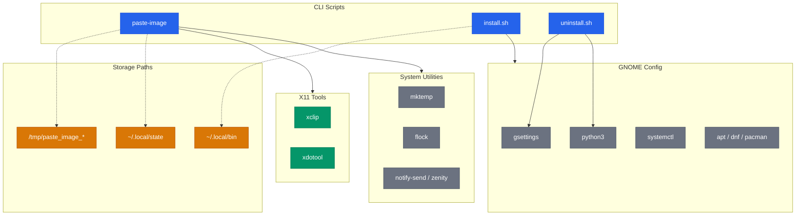
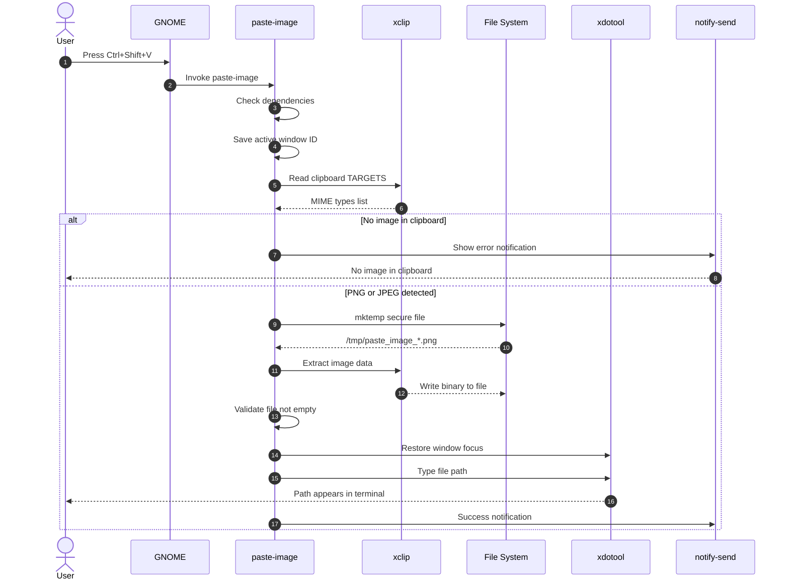

> **Language:** English | [Italiano](README.it.md)
>
> **See also:** [Security Policy (EN)](SECURITY.md) · [Politica di Sicurezza (IT)](SECURITY.it.md)

<div align="center">

[](https://github.com/AndreaBonn/cli-image-paste/actions/workflows/ci.yml)
[](https://github.com/koalaman/shellcheck)
[](LICENSE)
[](SECURITY.md)

</div>

# cli-image-paste

Paste images from your clipboard directly into the terminal as file paths — ready for any CLI coding assistant.

Press a keyboard shortcut, and the clipboard image is saved as a temporary file with its path automatically typed into the active terminal window.

## Why

CLI coding assistants like [Claude Code](https://docs.anthropic.com/en/docs/claude-code), [Aider](https://aider.chat), [Gemini CLI](https://github.com/google-gemini/gemini-cli), and others accept image files as input but have no native way to paste images from the system clipboard. This tool bridges that gap: copy an image, press the shortcut, and the file path is typed into the terminal — ready to send.

Works with **any CLI tool** that accepts file paths as input.

## Architecture



> For detailed technical diagrams (installation flow, CI/CD pipeline), see [docs/ARCHITECTURE.md](docs/ARCHITECTURE.md).

## Demo

```
# 1. Copy an image (screenshot, browser image, etc.)
# 2. Focus on the terminal running your coding assistant
# 3. Press Ctrl+Shift+V
# 4. The path gets typed automatically:

/tmp/paste_image_20260309_143022_a1b2c3.png
```

The filename includes a timestamp and a random suffix generated by `mktemp` for security and uniqueness.

### How it works



## Features

- Works on both **X11 and Wayland**, with the display server detected at runtime
- Global keyboard shortcut (configurable)
- Reads PNG and JPEG directly, converts WebP, GIF, TIFF, BMP, AVIF and SVG
- Uses the existing path when you copy an image **file** from a file manager, instead of duplicating it
- Delivery backend chosen automatically per session: `xdotool`, `wtype`, `ydotool` or the clipboard
- User configuration in `~/.config/paste-image/config`, preserved across upgrades
- Secure atomic file creation via `mktemp` with `0600` permissions
- Paths validated before typing: control characters and bidirectional overrides are refused
- ImageMagick runs under a dedicated restrictive policy with resource limits
- Desktop notifications for success and errors (with zenity fallback)
- Automatic cleanup of temporary files older than 7 days
- Log rotation with race-condition-safe writes via `flock`
- Cross-distro dependency installation (apt/dnf/pacman)
- Test suite of 145 cases, ShellCheck clean, executable size and purity gates


## System Requirements

| Requirement             | Detail                                                     |
| ----------------------- | ---------------------------------------------------------- |
| **OS**                  | Linux                                                      |
| **Display server**      | X11 or Wayland                                             |
| **Desktop environment** | GNOME for automatic shortcut setup, others work manually   |
| **Shell**               | Bash 4.4+                                                  |

**Image formats read directly:** PNG, JPEG.
**Converted when ImageMagick is present:** WebP, GIF, TIFF, BMP, AVIF.
**Converted when rsvg-convert is present:** SVG.

## Wayland support

Reading the clipboard works everywhere. Typing the path does not: it depends on
what the compositor implements, and there is no way to ask a compositor in
advance.

| Session | Compositor            | How the path is delivered                     |
| ------- | --------------------- | --------------------------------------------- |
| X11     | any                   | typed via `xdotool`                           |
| Wayland | sway, Hyprland, river | typed via `wtype`                             |
| Wayland | GNOME, Unity          | **copied to the clipboard**, you press Ctrl+V |
| Wayland | KDE, others           | `wtype` if it works, clipboard otherwise      |

On GNOME Wayland the clipboard is the default, not a fallback after a failure.
Mutter does not implement the `virtual-keyboard-unstable-v1` protocol that
`wtype` needs, and a fallback would only be discovered by failing after the file
had already been written, which reads as nothing happening at all. You get a
notification telling you the path is ready to paste.

### About ydotool

`ydotool` can type on any compositor, so it is available by setting
`TYPING_BACKEND=ydotool` in the config file. It is never selected
automatically, and that is deliberate.

`ydotool` needs a daemon with access to `/dev/uinput`. Anyone able to reach that
daemon can synthesise keystrokes into **any** application in your session,
including sudo prompts and password manager windows. That defeats the input
isolation which is Wayland's main security improvement over X11. If you enable
it, check that its socket is owner-only, and prefer a per-user daemon over
adding your account to a system-wide input group.


## Installation

```bash
git clone https://github.com/user/cli-image-paste.git
cd cli-image-paste
bash install.sh
```

The installer handles everything:

1. Detects and installs missing dependencies (`xclip`, `xdotool`, `libnotify-bin`)
2. Copies the script to `~/.local/bin/paste-image`
3. Adds `~/.local/bin` to your PATH if needed
4. Configures a GNOME global keyboard shortcut (default: `Ctrl+Shift+V`)
5. Verifies the `gsd-media-keys` service is running

You'll be prompted to choose a custom shortcut or accept the default.

### Dependencies

| Dependency      | Purpose                                  | Required    |
| --------------- | ---------------------------------------- | ----------- |
| `xclip`         | Read the clipboard on X11                | on X11      |
| `wl-clipboard`  | Read the clipboard on Wayland            | on Wayland  |
| `xdotool`       | Type the path on X11                     | recommended |
| `wtype`         | Type the path on wlroots compositors     | optional    |
| `imagemagick`   | Convert WebP, GIF, TIFF, BMP, AVIF       | optional    |
| `librsvg2-bin`  | Convert SVG (`rsvg-convert`)             | optional    |
| `notify-send`   | Desktop notifications                    | recommended |
| `python3`       | JSON config manipulation during install  | GNOME only  |

Optional dependencies degrade with a message naming the package to install,
they never block the tool.

```bash
# Ubuntu/Debian
sudo apt install xclip xdotool libnotify-bin

# Fedora
sudo dnf install xclip xdotool libnotify

# Arch
sudo pacman -S xclip xdotool libnotify
```

## Usage

### Via keyboard shortcut (recommended)

1. **Copy an image** to your clipboard (screenshot, right-click > copy image, etc.)
2. **Focus on the terminal** where your coding assistant is running
3. **Press the shortcut** (default: `Ctrl+Shift+V`)
4. The image is saved and its path is typed into the terminal
5. **Press Enter** to send it to the coding assistant

The output format adapts to the assistant running in the terminal: a bare
path for Claude Code, `/add <path>` for Aider, `@<path>` for Gemini CLI.
Detection walks down the process tree of the focused window, so it only works
on X11; elsewhere, and for any program not in the list, the bare path is used
because it is always pasteable. Setting `FORMAT_TEMPLATE` in the config
overrides detection.

### Annotating before delivering

```bash
paste-image --annotate
paste-image --screenshot --annotate
```

Opens satty or swappy so you can point at the thing you are asking about, or
blur what should not leave your machine. It runs last, after any resizing,
because annotations applied before a shrink come out unreadable.

Closing the editor without saving delivers the original: that is a decision,
not a failure. Asking for `--annotate` without either tool installed is an
error, though, because silently ignoring a flag you just typed is worse than
saying no.

### Diagnostics

```bash
paste-image --doctor
```

Prints the detected session and desktop, which delivery backend was chosen
and why, which tools are present, and any backend that was excluded after
failing. Worth including in a bug report: the behaviour depends on the
environment in ways that are invisible from the outside.

### Re-delivering the last image

```bash
paste-image --last      # the most recent
paste-image --last 3    # the third most recent
```

Delivering through the clipboard overwrites the clipboard itself, which
destroys the source image: a second attempt would otherwise mean taking the
screenshot again. The file is still on disk, and this is what hands it over
again. If the image has since been cleaned up, that is said rather than
typing a dead path.

### Capturing a screenshot directly

```bash
paste-image --screenshot
```

Selects an area, saves it and hands over the path in one step, skipping the
copy-then-paste round trip. Bind it to a second shortcut and it becomes the
fastest way to show something to an assistant.

The capture tool is picked per environment: `gnome-screenshot` on GNOME,
`spectacle` on KDE, `grim` with `slurp` on wlroots compositors, falling back
to `flameshot`, `maim`, `scrot` or `import`. Cancelling the selection is
treated as a decision, not a failure: nothing is written and no error is
reported.

### Manual invocation

```bash
paste-image            # Run the script directly
paste-image --version  # Show version
paste-image -v         # Show version (short form)
```

## Configuration

### Keyboard shortcut per desktop

The installer knows how each environment stores its shortcuts, and never
fails when it does not: worst case it prints what to do by hand.

| Desktop            | How the shortcut is registered                              |
| ------------------ | ----------------------------------------------------------- |
| GNOME, Unity       | written automatically via `gsettings`                       |
| KDE Plasma         | written to `kglobalshortcutsrc`, with a backup taken first   |
| sway, Hyprland, i3 | the exact config line is printed for you to paste            |
| anything else      | the command to bind is printed                               |

On window managers nothing is edited for you: that config file is yours. To
get the line again later:

```bash
paste-image --print-shortcut sway       # or i3, hyprland
paste-image --print-shortcut sway '<Super>v'
```

Modifier names differ per environment. `<Super>` is `Meta` on KDE, `Mod4` on
sway and i3, `SUPER` on Hyprland: the installer converts them, so you only
ever type the GTK form.

The default is `Ctrl+Shift+V` on X11 and `Super+V` on Wayland. On Wayland the
path is delivered through the clipboard, and `Ctrl+Shift+V` is already the
terminal's paste, so the two would fight each other.

**KDE note:** the file contents are covered by tests, but the shortcut
actually firing on KDE has not been verified: no machine was available. If
you run KDE and it does not work, that is worth reporting.

### Changing the keyboard shortcut

During installation you can choose a custom shortcut. After installation, change it with:

```bash
gsettings set org.gnome.settings-daemon.plugins.media-keys.custom-keybinding:/org/gnome/settings-daemon/plugins/media-keys/custom-keybindings/paste-image/ binding "<Control><Alt>v"
```

Modifier key format: `<Control>`, `<Shift>`, `<Alt>`, `<Super>`.

You can also change it from **Settings > Keyboard > Shortcuts > Custom Shortcuts**.

> **Note:** `Ctrl+Shift+V` is the default paste shortcut in most Linux terminals. If this causes conflicts, choose a different shortcut (e.g. `<Control><Alt>v`).

### Script configuration

Settings live in `~/.config/paste-image/config` (or `$XDG_CONFIG_HOME/paste-image/config`).
The file survives upgrades: in version 1 these values were edited inside the
installed script, so every reinstall wiped them. `install.sh` migrates them for
you the first time.

A commented reference file ships as `config.example`. The most useful keys:

| Key                    | Default | Description                                                    |
| ---------------------- | ------- | -------------------------------------------------------------- |
| `OUTPUT_DIR`           | `/tmp`  | Where images are saved                                          |
| `TYPING_BACKEND`       | auto    | `xdotool`, `wtype`, `ydotool` or `clipboard`                    |
| `FORMAT_TEMPLATE`      | empty   | Output template, exactly one `%s`, e.g. `/add %s` for Aider     |
| `PREFER_EXISTING_FILE` | `1`     | Use the path of a copied file instead of duplicating it         |
| `MAX_LONG_SIDE`        | `1568`  | Long-side limit in pixels (resizing lands in a later release)   |
| `CLEANUP_DAYS`         | `7`     | Auto-delete temp files older than N days                        |
| `TYPING_DELAY`         | `0.1`   | Delay before typing the path (seconds)                          |

Unknown keys and invalid values are refused and logged, never applied silently.
The file is parsed, never sourced: a config file that gets executed on every
shortcut press would be arbitrary code execution.

Every key also accepts an environment override named `PASTE_IMAGE_<KEY>`, which
wins over the file.


### Log files

Logs are stored at `~/.local/state/paste-image/paste_image.log` (or `$XDG_STATE_HOME/paste-image/` if set).

- Format: `[YYYY-MM-DD HH:MM:SS] message`
- Automatic rotation at 500 lines (keeps last 250)
- Race-condition-safe writes using `flock`
- Contains timestamps and file paths only (no clipboard content)

## Uninstallation

```bash
bash uninstall.sh
```

This removes:
- The script from `~/.local/bin/paste-image`
- The GNOME keyboard shortcut
- PATH modifications from `.bashrc` and `.zshrc`
- Log directory (`~/.local/state/paste-image/`)
- Temporary files in `/tmp/paste_image_*`

System dependencies are intentionally left installed (they may be used by other programs). Temporary files older than 7 days are cleaned automatically on each invocation; newer ones are removed on system reboot.

## Troubleshooting

### The path doesn't appear in the terminal

- Make sure the terminal has focus when you press the shortcut
- Verify X11 is in use: `echo $XDG_SESSION_TYPE` should return `x11`
- Try running `paste-image` manually to see error output

### "No image in clipboard" notification

- Make sure you copied an actual image (not text or a file)
- Some applications don't copy images to the system clipboard

### Shortcut doesn't work but manual invocation does

The GNOME service that handles custom shortcuts (`gsd-media-keys`) may not be running:

```bash
# Check if it's active
pgrep -x gsd-media-keys

# If it returns nothing, restart it
systemctl --user start org.gnome.SettingsDaemon.MediaKeys.target
```

If the problem persists:

- Verify the shortcut is registered: `gsettings get org.gnome.settings-daemon.plugins.media-keys custom-keybindings`
- Check for conflicts with other system shortcuts

### Image saves but path isn't typed

- Increase `TYPING_DELAY` in the script configuration (default: `0.1` seconds)
- Some terminal emulators may need a longer delay for `xdotool` to work correctly

## Project Structure

```
cli-image-paste/
├── lib/                 # Sorgenti modulari, concatenati a build time
│   ├── 00_header.sh
│   ├── 05_text.sh
│   ├── 10_env_detect.sh
│   ├── 15_config.sh
│   ├── 20_clipboard.sh
│   ├── 30_delivery.sh
│   ├── 40_transform.sh
│   ├── 50_store.sh
│   └── 90_main.sh
├── scripts/
│   ├── build.sh              # lib/*.sh -> dist/paste-image
│   ├── migrate-config.sh
│   └── check-shortcut-service.sh
├── dist/paste-image     # Artefatto generato, non versionato
├── install.sh
├── uninstall.sh
├── config.example
├── CLAUDE.md
├── tests/
│   ├── run_tests.sh
│   ├── framework/
│   └── test_*.sh
└── docs/
```

The executable is generated, not written by hand: sources live in `lib/` and
`scripts/build.sh` concatenates them in numeric order. Edit a module, then
rebuild. Installation stays a single file, so uninstalling leaves nothing
behind.

## Running Tests

```bash
bash tests/run_tests.sh
```

The test suite includes 145 test cases covering:

- Main script functionality (18 tests): dependency checks, clipboard handling, MIME type detection, mktemp security, file cleanup, notifications, version flag
- Installation flow (12 tests): dependency installation, PATH configuration, gsettings array manipulation, shortcut conflict detection, idempotency
- Uninstallation flow (7 tests): script removal, gsettings cleanup, PATH cleanup

Tests use mocked system utilities for safe execution without requiring actual X11 or GNOME.

Static analysis with ShellCheck:

```bash
shellcheck paste-image install.sh uninstall.sh
```

All scripts pass ShellCheck validation with zero warnings.

## Limitations

- **Typing is not possible on GNOME Wayland**: the path goes to the clipboard instead, see the Wayland section above
- **Automatic shortcut setup is GNOME only**: on other desktops you add the shortcut yourself
- **The terminal must have focus** when the shortcut is pressed
- Formats other than PNG and JPEG need ImageMagick, or rsvg-convert for SVG

## Contributing

1. Fork the repository
2. Create a feature branch (`git checkout -b feature/my-feature`)
3. Make sure all tests pass (`bash tests/run_tests.sh`)
4. Make sure ShellCheck passes (`shellcheck paste-image install.sh uninstall.sh`)
5. Commit your changes and open a pull request

## Security

For information about security considerations and how to report vulnerabilities, see [SECURITY.md](SECURITY.md).

## License

This project is licensed under the [MIT License](LICENSE).

## Support the project

cli-image-paste is free to use. If it helps you and you want to give something back, you can leave a tip via PayPal. The amount is up to you and it is entirely optional.

<div align="center">

[](https://paypal.me/AndreaBonacci19)

</div>
