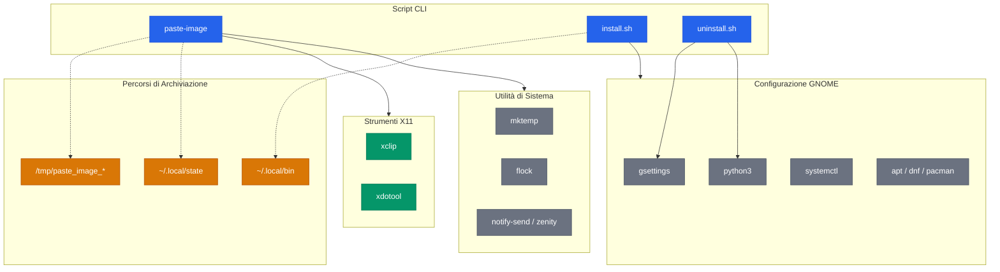
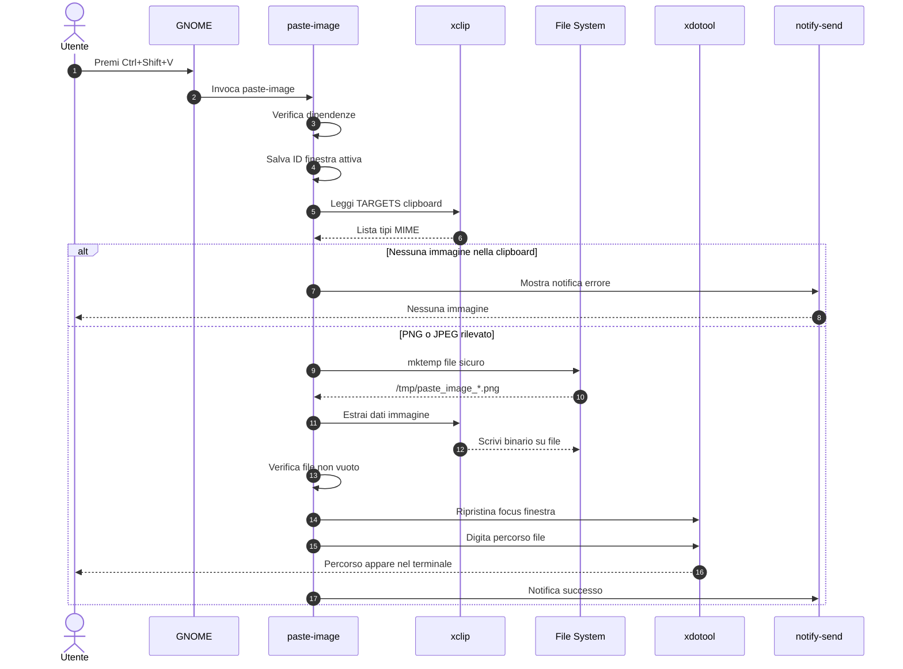
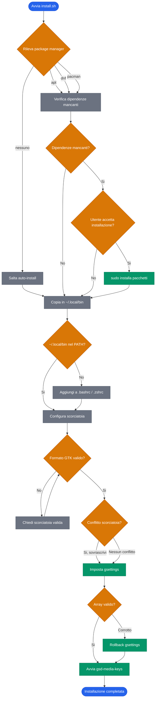
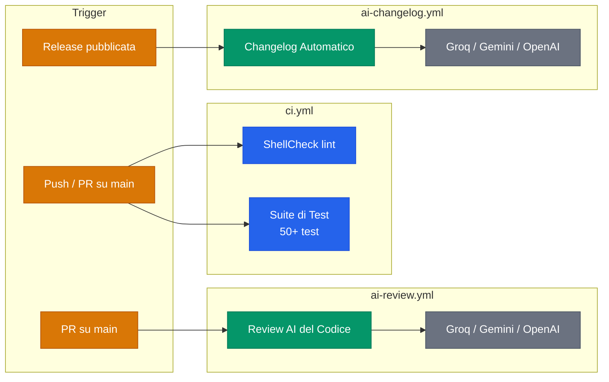

> **Lingua:** Italiano | [English](ARCHITECTURE.md)

# Architettura

Diagrammi tecnici degli internals di cli-image-paste.

## Panoramica del Sistema

Tre script CLI interagiscono con strumenti X11, utility di sistema e configurazione GNOME per trasformare immagini dalla clipboard in percorsi file nel terminale.

**Legenda:** Blu = script del progetto, Verde = strumenti X11, Grigio = utility di sistema, Arancione = percorsi di archiviazione. Linee tratteggiate = I/O file, linee continue = dipendenza runtime.

## Flusso di Esecuzione

Esecuzione dello script `paste-image` dalla scorciatoia da tastiera alla digitazione del percorso nel terminale, incluso il path di errore quando non viene trovata un'immagine nella clipboard.

Dettagli implementativi chiave:
- **Step 4:** `xdotool getactivewindow` salva l'ID della finestra terminale prima di qualsiasi operazione clipboard
- **Step 8:** `mktemp` crea il file con permessi 0600 e suffisso casuale (nessun TOCTOU)
- **Step 13-14:** `xdotool windowfocus --sync` ripristina il focus, poi `xdotool type --clearmodifiers` digita il percorso

## Flusso di Installazione

L'albero decisionale di `install.sh` con rilevamento package manager, installazione dipendenze, configurazione scorciatoia, gestione conflitti e validazione array gsettings con rollback.

**Legenda:** Blu = inizio/fine, Arancione = punti decisionali, Verde = operazioni di sistema, Grigio = step dello script.

Pattern difensivi notevoli:
- **Rollback:** se l'array `gsettings` risulta corrotto dopo la modifica, il valore precedente viene ripristinato
- **Idempotente:** eseguire `install.sh` due volte produce lo stesso risultato (check PATH, check gsettings)
- **Python3 per JSON:** gli array gsettings vengono parsati via Python3 per evitare problemi di glob expansion in bash

## Pipeline CI/CD

Tre workflow GitHub Actions attivati da eventi diversi.

**Legenda:** Arancione = eventi trigger, Blu = quality gate, Verde = automazione AI, Grigio = provider LLM.

I workflow di AI review e changelog usano una catena di fallback su tre provider LLM per resilienza.
