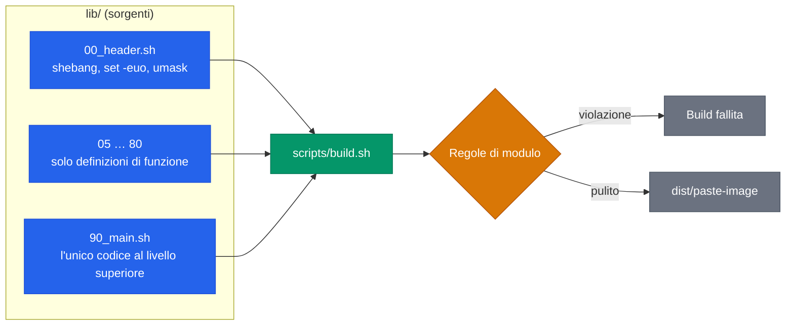
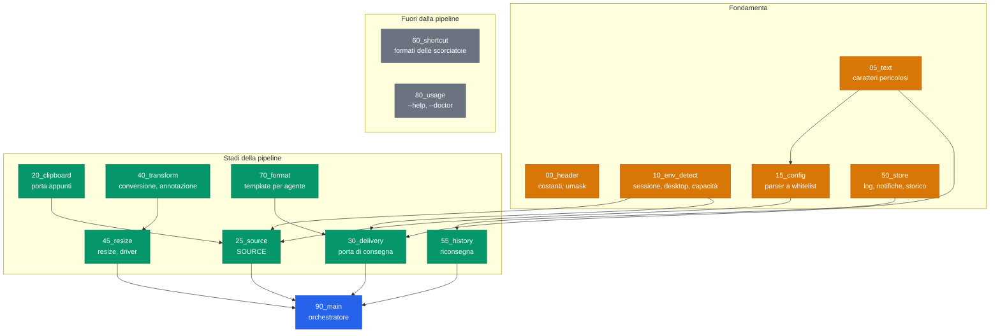
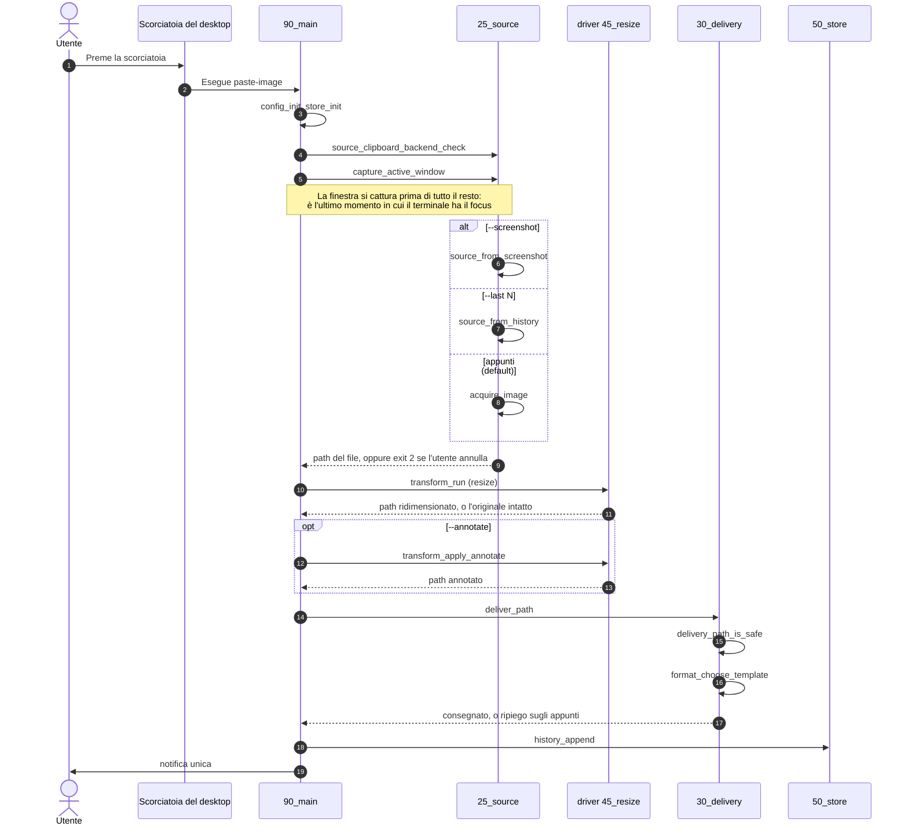
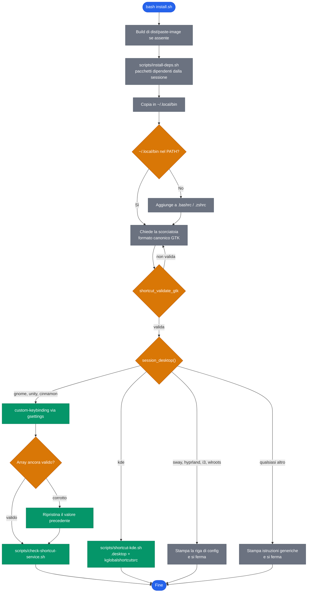
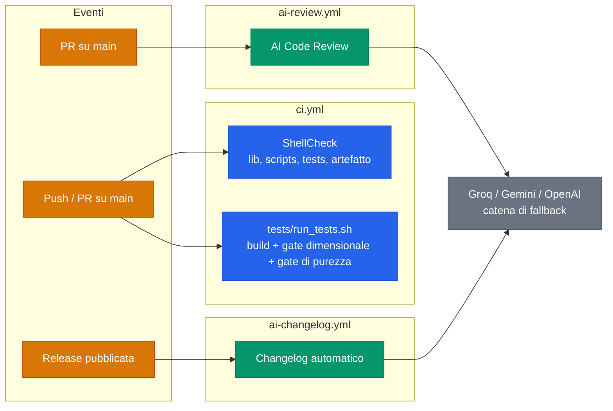

> **Lingua:** Italiano | [English](ARCHITECTURE.md)

# Architettura

Diagrammi tecnici del funzionamento interno di cli-image-paste, aggiornati
alla 2.0.

Le decisioni di progetto che stanno dietro a queste strutture, comprese le
alternative scartate, sono in [`specs/001-wayland-multi-de-pipeline/plan.md`](../specs/001-wayland-multi-de-pipeline/plan.md).
Questo file descrive che cosa fa il codice oggi.

## L'eseguibile è generato

Non esiste un file `paste-image` da modificare. I sorgenti stanno in
`lib/NN_nome.sh` e `scripts/build.sh` li concatena, in ordine numerico, in
`dist/paste-image`. Quella directory è in `.gitignore`, quindi un artefatto
stantio non può finire nella history.

```mermaid
%%{init: {'theme': 'default'}}%%
graph LR
  subgraph src["lib/ (sorgenti)"]
    direction TB
    header["00_header.sh<br/>shebang, set -euo, umask"]
    modules["05 … 80<br/>solo definizioni di funzione"]
    mainmod["90_main.sh<br/>l'unico codice al livello superiore"]
  end

  build["scripts/build.sh"]
  gate{"Regole di modulo"}
  artifact["dist/paste-image"]

  header --> build
  modules --> build
  mainmod --> build
  build --> gate
  gate -->|"violazione"| fail["Build fallita"]
  gate -->|"pulito"| artifact

  classDef core fill:#2563eb,stroke:#1d4ed8,color:#fff
  classDef data fill:#d97706,stroke:#b45309,color:#fff
  classDef ext fill:#6b7280,stroke:#4b5563,color:#fff
  classDef engine fill:#059669,stroke:#047857,color:#fff

  class header,modules,mainmod core
  class gate data
  class build engine
  class artifact,fail ext
```

Le regole che la build verifica, prima di scrivere qualsiasi cosa:

- ogni sorgente rispetta il pattern `NN_nome.sh`, perché un file fuori
  pattern verrebbe escluso dall'artefatto in silenzio
- `00_header.sh` viene per primo ed è l'unico modulo con shebang o `set -e`
- nessun modulo tranne `90_main.sh` contiene un `exit` al livello superiore,
  che terminerebbe lo script a metà concatenazione

La garanzia più ampia, cioè che nessun modulo esegua nulla al momento del
source, è verificata da `tests/test_no_side_effects.sh`. È ciò che permette a
un test di sorgiare un singolo modulo e di esercitarne le funzioni in
isolamento.

## Mappa dei moduli

Il prefisso numerico è l'ordine di dipendenza. Bash non ha import, quindi
l'ordine sta nel nome del file invece di essere scoperto con un errore a
runtime.

```mermaid
%%{init: {'theme': 'default'}}%%
graph TD
  subgraph base["Fondamenta"]
    direction LR
    m00["00_header<br/>costanti, umask"]
    m05["05_text<br/>caratteri pericolosi"]
    m10["10_env_detect<br/>sessione, desktop, capacità"]
    m15["15_config<br/>parser a whitelist"]
    m50["50_store<br/>log, notifiche, storico"]
  end

  subgraph stages["Stadi della pipeline"]
    direction LR
    m25["25_source<br/>SOURCE"]
    m20["20_clipboard<br/>porta appunti"]
    m55["55_history<br/>riconsegna"]
    m40["40_transform<br/>conversione, annotazione"]
    m45["45_resize<br/>resize, driver"]
    m30["30_delivery<br/>porta di consegna"]
    m70["70_format<br/>template per agente"]
  end

  subgraph aux["Fuori dalla pipeline"]
    direction LR
    m60["60_shortcut<br/>formati delle scorciatoie"]
    m80["80_usage<br/>--help, --doctor"]
  end

  m90["90_main<br/>orchestratore"]

  m05 --> m15
  m05 --> m30
  m10 --> m25
  m10 --> m30
  m15 --> m25
  m50 --> m55
  m20 --> m25
  m40 --> m45
  m25 --> m90
  m45 --> m90
  m55 --> m90
  m30 --> m90
  m70 --> m30

  classDef core fill:#2563eb,stroke:#1d4ed8,color:#fff
  classDef data fill:#d97706,stroke:#b45309,color:#fff
  classDef ext fill:#6b7280,stroke:#4b5563,color:#fff
  classDef engine fill:#059669,stroke:#047857,color:#fff

  class m90 core
  class m25,m20,m55,m40,m45,m30,m70 engine
  class m00,m05,m10,m15,m50 data
  class m60,m80 ext
```

**Legenda:** blu = orchestratore, verde = stadi della pipeline, arancione =
fondamenta, grigio = codice raggiungibile solo da un flag o dall'installer.

`60_shortcut.sh` e `80_usage.sh` stanno fuori dal percorso dell'immagine. Il
primo è consumato da `install.sh` e da `--print-shortcut`, il secondo solo da
`--help` e `--doctor`.

## Due porte, non un backend unico

Leggere gli appunti e consegnare il path sono assi ortogonali, e la
separazione esiste perché su GNOME Wayland il primo funziona e solo il secondo
è rotto. Collassarli in un unico "backend" legherebbe una metà funzionante a
una che fallisce.

| Sessione | Desktop | Catena di consegna | Perché |
|---|---|---|---|
| X11 | qualsiasi | `xdotool`, poi appunti | `xdotool type` funziona ovunque su X11 |
| Wayland | GNOME, Unity, Cinnamon | solo appunti | Mutter non implementa il protocollo virtual-keyboard che serve a `wtype` |
| Wayland | sway, Hyprland, wlroots | `wtype`, poi appunti | i compositori wlroots lo implementano |
| Wayland | qualsiasi altro | `wtype`, poi appunti | ottimistico, con gli appunti sotto |
| ignota | qualsiasi | appunti | l'unico backend che nessun compositore può negare |

Su GNOME Wayland gli appunti sono la prima voce, non un ripiego. Un ripiego si
scopre fallendo, e `wtype` fallirebbe dopo che il file è già stato scritto,
con un esito che l'utente vede come "non è successo niente".

Un compositore non si può interrogare sul supporto a virtual-keyboard, quindi
la risposta si impara provando. Il fallimento viene registrato in
`~/.local/state/paste-image/capabilities` sotto una chiave
`sessione:desktop:versione` e non viene ritentato. La chiave è l'identità
dell'ambiente e non un timestamp, perché il tempo non è la variabile che fa
cambiare la risposta.

## Flusso di esecuzione

`SOURCE → TRANSFORM* → STORE → DELIVERY`. Lo screenshot è una sorgente
alternativa e non una trasformazione, l'annotazione è una trasformazione
interattiva.

```mermaid
sequenceDiagram
  autonumber
  actor user as Utente
  participant desktop as Scorciatoia del desktop
  participant main as 90_main
  participant src as 25_source
  participant tf as driver 45_resize
  participant del as 30_delivery
  participant store as 50_store

  user->>desktop: Preme la scorciatoia
  desktop->>main: Esegue paste-image
  main->>main: config_init, store_init
  main->>src: source_clipboard_backend_check
  main->>src: capture_active_window

  Note over main,src: La finestra si cattura prima di tutto il resto:<br/>è l'ultimo momento in cui il terminale ha il focus

  alt --screenshot
    src->>src: source_from_screenshot
  else --last N
    src->>src: source_from_history
  else appunti (default)
    src->>src: acquire_image
  end
  src-->>main: path del file, oppure exit 2 se l'utente annulla

  main->>tf: transform_run (resize)
  tf-->>main: path ridimensionato, o l'originale intatto

  opt --annotate
    main->>tf: transform_apply_annotate
    tf-->>main: path annotato
  end

  main->>del: deliver_path
  del->>del: delivery_path_is_safe
  del->>del: format_choose_template
  del-->>main: consegnato, o ripiego sugli appunti
  main->>store: history_append
  main->>user: notifica unica
```

Dettagli che il diagramma non mostra:

- **Il passo 5** è presto di proposito. Ogni passo successivo che apre una
  finestra propria, la selezione dell'area o l'editor di annotazione,
  renderebbe inutile una cattura tardiva: prenderebbe quella finestra.
- **Il passo 12** non modifica mai in place. Se la sorgente è un file
  indicato dall'utente dal file manager, ridimensionarlo sul posto
  altererebbe un suo file senza che l'abbia chiesto. L'originale viene
  rimosso solo quando il prefisso dice che l'abbiamo creato noi.
- **Il passo 15** è dove ogni stringa diretta al terminale viene validata.
  Ciò che viene digitato è input di shell, e un carattere di controllo nel
  path equivale a premere Invio nel prompt in attesa.
- **Il passo 18** avviene solo dopo una consegna riuscita. Uno storico che
  contiene tentativi falliti manda l'utente a ripescare qualcosa che non ha
  mai funzionato.
- Alla fine viene emessa una sola notifica. Due consecutive per una sola
  azione sono rumore, e la seconda copre la prima prima che si riesca a
  leggerla.

## Annullare non è fallire

Tre uscite lasciano il tool in silenzio di proposito: annullare la selezione
di un'area, chiudere l'editor di annotazione senza salvare, e gli appunti
vuoti segnalati una volta sola. Solo l'ultimo caso notifica, perché l'utente
ha chiesto qualcosa e non è successo niente. I primi due sono decisioni.

## Step di trasformazione

Ogni step è una funzione `file → file`. Non conosce la pipeline, non alloca
temporanei propri e non decide se saltare sé stesso.

| Step | Innesco | In caso di fallimento |
|---|---|---|
| conversione | il MIME della sorgente non è PNG né JPEG | errore, l'immagine non è utilizzabile affatto |
| resize | lato lungo oltre `MAX_LONG_SIDE` (default 1568) | prosegue con l'originale, annotato nel log |
| annotazione | solo con `--annotate` | errore, perché ignorare un flag appena scritto è l'esito peggiore possibile |

L'asimmetria è voluta. Un miglioramento accessorio non deve mai far fallire
l'operazione, ma una richiesta esplicita non deve mai essere scartata in
silenzio.

ImageMagick gira sotto una `policy.xml` dedicata, fornita via
`MAGICK_CONFIGURE_PATH`, con limiti di risorsa sulla riga di comando e argv
passato come array. Gli SVG vengono instradati su `rsvg-convert`.

Gli intermedi sono registrati in un array centrale e rimossi da un `trap` in
uscita, anche quando uno step fallisce a metà. La pipeline moltiplica le copie
di un contenuto che può essere sensibile.

## Installazione

`install.sh` è un dispatcher su `session_desktop()`. Non reimplementa
l'installazione: la copia dei file passa dal `Makefile`, che supporta `PREFIX`
e `DESTDIR`.

```mermaid
%%{init: {'theme': 'default'}}%%
graph TD
  start_node(["bash install.sh"]) --> build_step["Build di dist/paste-image se assente"]
  build_step --> deps["scripts/install-deps.sh<br/>pacchetti dipendenti dalla sessione"]
  deps --> copy_script["Copia in ~/.local/bin"]
  copy_script --> check_path{"~/.local/bin nel PATH?"}
  check_path -->|"No"| add_path["Aggiunge a .bashrc / .zshrc"]
  check_path -->|"Sì"| ask_shortcut
  add_path --> ask_shortcut["Chiede la scorciatoia<br/>formato canonico GTK"]

  ask_shortcut --> validate{"shortcut_validate_gtk"}
  validate -->|"non valida"| ask_shortcut
  validate -->|"valida"| dispatch{"session_desktop()"}

  dispatch -->|"gnome, unity, cinnamon"| gsettings["custom-keybinding via gsettings"]
  dispatch -->|"kde"| kde["scripts/shortcut-kde.sh<br/>.desktop + kglobalshortcutsrc"]
  dispatch -->|"sway, hyprland, i3, wlroots"| print_wm["Stampa la riga di config<br/>e si ferma"]
  dispatch -->|"qualsiasi altro"| generic["Stampa istruzioni generiche<br/>e si ferma"]

  gsettings --> verify{"Array ancora valido?"}
  verify -->|"corrotto"| rollback["Ripristina il valore precedente"]
  verify -->|"valido"| service["scripts/check-shortcut-service.sh"]
  rollback --> service

  service --> done_node(["Fine"])
  kde --> done_node
  print_wm --> done_node
  generic --> done_node

  classDef core fill:#2563eb,stroke:#1d4ed8,color:#fff
  classDef data fill:#d97706,stroke:#b45309,color:#fff
  classDef ext fill:#6b7280,stroke:#4b5563,color:#fff
  classDef engine fill:#059669,stroke:#047857,color:#fff

  class start_node,done_node core
  class check_path,validate,dispatch,verify data
  class gsettings,kde,service,rollback engine
  class build_step,deps,copy_script,add_path,ask_shortcut,print_wm,generic ext
```

**Legenda:** blu = inizio e fine, arancione = punti di decisione, verde =
operazioni di sistema, grigio = passi dello script.

Su un window manager non esiste un registro da scrivere: la scorciatoia vive
nel file di configurazione dell'utente. Stampare la riga esatta e fermarsi è
più utile che fallire, e meno invasivo che modificargli il file.
`uninstall.sh` rispecchia lo stesso dispatch, e preserva la configurazione
utente mentre rimuove la cache delle capacità.

## Configurazione

`~/.config/paste-image/config` viene **parsato, mai sorgiato**. Sorgiare un
file di configurazione è esecuzione di codice arbitrario a ogni pressione
della scorciatoia, incoerente con un progetto che pubblica un `SECURITY.md`.

Solo le chiavi in whitelist vengono accettate e ognuna passa una validazione
per tipo. Chiavi ignote e valori non validi finiscono nel log invece di essere
applicati in silenzio, perché una chiave scartata senza segnale è
indistinguibile da una applicata.

Precedenza: default < file < variabile d'ambiente `PASTE_IMAGE_<CHIAVE>` <
flag da riga di comando. Il template di formato ha una validazione più
stretta: whitelist di caratteri, esattamente un `%s`, lunghezza massima. La
sostituzione usa `${template//%s/$path}` e mai `printf "$template" "$path"`,
che tratterebbe input esterno come format string.

## Test e CI

Il runner è il gate. `bash tests/run_tests.sh` builda l'artefatto, fallisce
oltre le 300 righe per sorgente invece di avvisare, esegue ShellCheck a zero
warning su tutti i percorsi, poi le suite.

```mermaid
%%{init: {'theme': 'default'}}%%
graph LR
  subgraph triggers["Eventi"]
    direction TB
    push_pr["Push / PR su main"]
    pr_only["PR su main"]
    release["Release pubblicata"]
  end

  subgraph ci_workflow["ci.yml"]
    direction TB
    shellcheck["ShellCheck<br/>lib, scripts, tests, artefatto"]
    test_suite["tests/run_tests.sh<br/>build + gate dimensionale + gate di purezza"]
  end

  subgraph review_workflow["ai-review.yml"]
    direction TB
    ai_review["AI Code Review"]
  end

  subgraph changelog_workflow["ai-changelog.yml"]
    direction TB
    ai_changelog["Changelog automatico"]
  end

  providers["Groq / Gemini / OpenAI<br/>catena di fallback"]

  push_pr --> shellcheck
  push_pr --> test_suite
  pr_only --> ai_review
  release --> ai_changelog
  ai_review --> providers
  ai_changelog --> providers

  classDef core fill:#2563eb,stroke:#1d4ed8,color:#fff
  classDef data fill:#d97706,stroke:#b45309,color:#fff
  classDef ext fill:#6b7280,stroke:#4b5563,color:#fff
  classDef engine fill:#059669,stroke:#047857,color:#fff

  class push_pr,pr_only,release data
  class shellcheck,test_suite core
  class ai_review,ai_changelog engine
  class providers ext
```

**Legenda:** arancione = eventi, blu = gate di qualità, verde = automazione
con LLM, grigio = provider.

Poiché una sola macchina di sviluppo non può fornire ogni display server e
ogni desktop, la verifica è divisa in tre livelli: L1 sorgia una funzione pura
e ne asserisce l'output, L2 usa binari finti su `PATH` con ambiente forzato,
L3 è manuale su hardware reale. Cosa è verificato e cosa no è registrato in
[MANUAL_TESTING.it.md](MANUAL_TESTING.it.md), che è anche la ragione per cui
il nucleo funzionale è scritto come funzioni pure: è ciò che tiene
verificabile il comportamento su desktop che non possediamo.
