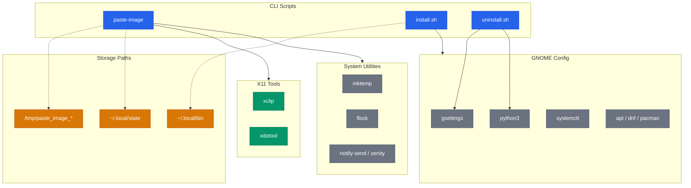
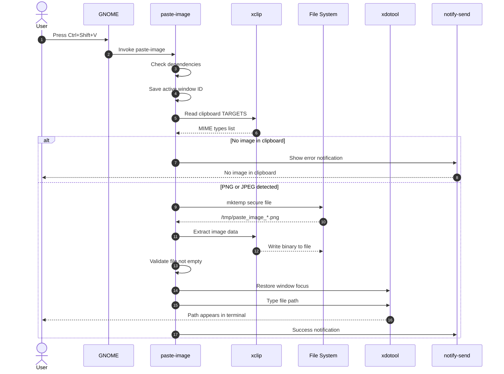
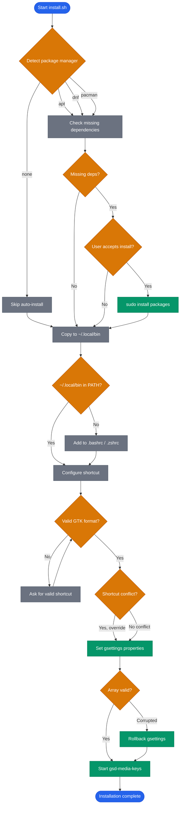
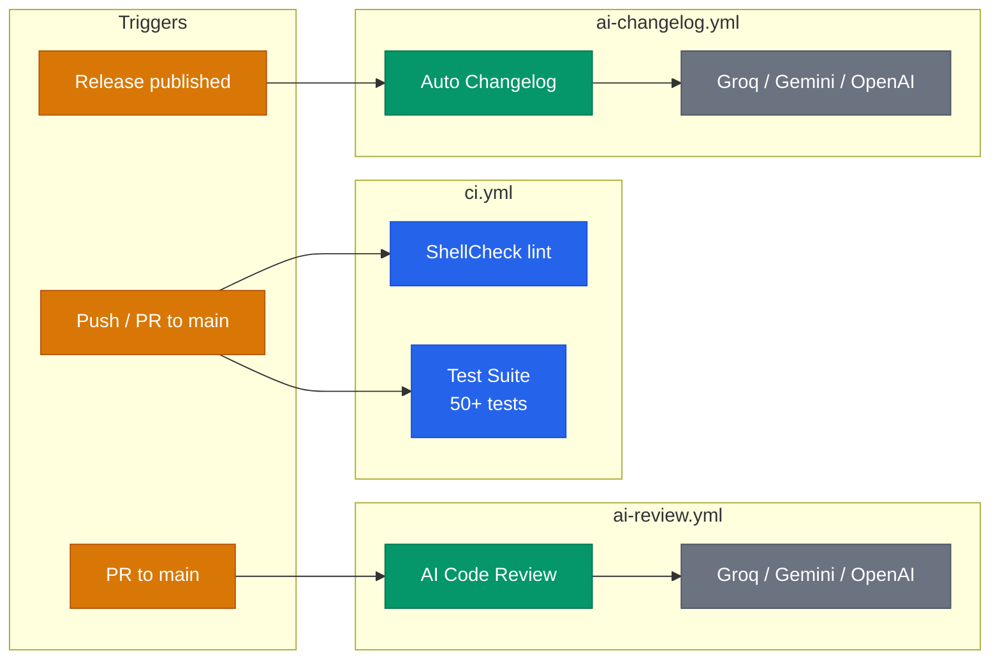

> **Language:** English | [Italiano](ARCHITECTURE.it.md)

# Architecture

Technical diagrams for cli-image-paste internals.

## System Overview

Three CLI scripts interact with X11 tools, system utilities, and GNOME configuration to bridge clipboard images into terminal file paths.

**Legend:** Blue = project scripts, Green = X11 tools, Grey = system utilities, Orange = storage paths. Dashed lines = file I/O, solid lines = runtime dependency.

## Runtime Flow

The `paste-image` script execution from keyboard shortcut to file path typed in terminal, including the error path when no image is found in the clipboard.

Key implementation details:
- **Step 4:** `xdotool getactivewindow` saves the terminal window ID before any clipboard operation
- **Step 8:** `mktemp` creates the file with 0600 permissions and a random suffix (no TOCTOU)
- **Step 13-14:** `xdotool windowfocus --sync` restores focus, then `xdotool type --clearmodifiers` types the path

## Installation Flow

The `install.sh` decision tree with package manager detection, dependency installation, shortcut configuration, conflict handling, and gsettings array validation with rollback.

**Legend:** Blue = start/end, Orange = decision points, Green = system operations, Grey = script steps.

Notable defensive patterns:
- **Rollback:** if `gsettings` array becomes corrupted after modification, the previous value is restored
- **Idempotent:** running `install.sh` twice produces the same result (PATH check, gsettings check)
- **Python3 for JSON:** gsettings arrays are parsed via Python3 to avoid bash glob expansion issues

## CI/CD Pipeline

Three GitHub Actions workflows triggered by different events.

**Legend:** Orange = trigger events, Blue = quality gates, Green = AI-powered automation, Grey = LLM providers.

The AI review and changelog workflows use a fallback chain across three LLM providers for resilience.
