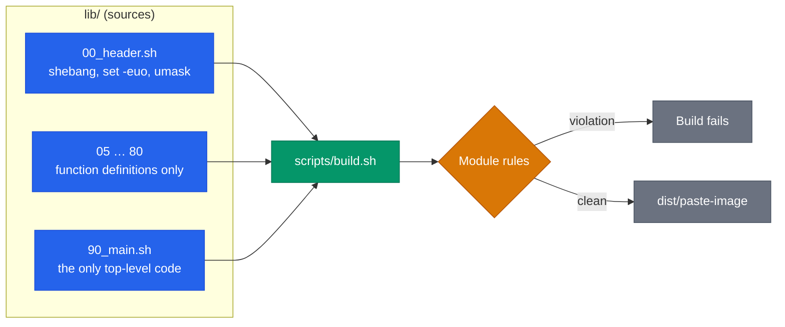
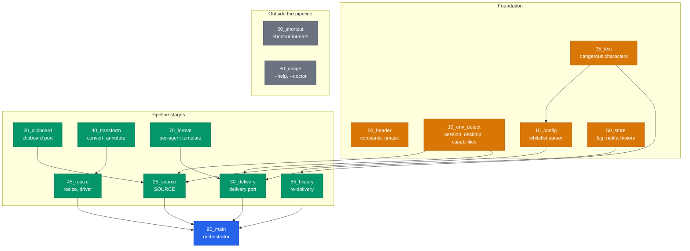
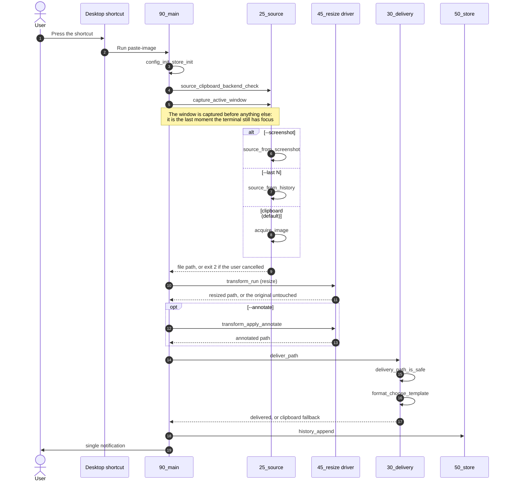
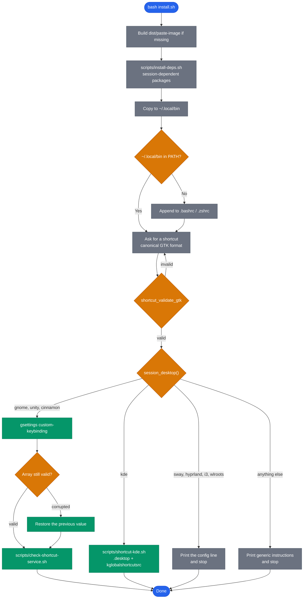
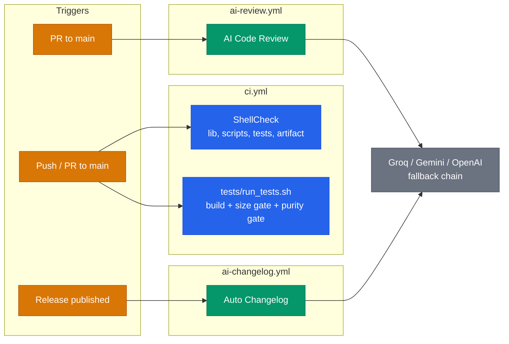

> **Language:** English | [Italiano](ARCHITECTURE.it.md)

# Architecture

Technical diagrams for cli-image-paste internals, as of 2.0.

The design decisions behind these structures, including the alternatives that
were rejected, live in [`specs/001-wayland-multi-de-pipeline/plan.md`](../specs/001-wayland-multi-de-pipeline/plan.md).
This file describes what the code does today.

## The executable is generated

There is no `paste-image` file to edit. Sources live in `lib/NN_name.sh` and
`scripts/build.sh` concatenates them, in numeric order, into
`dist/paste-image`. That directory is in `.gitignore`, so a stale artifact
cannot be committed.

```mermaid
%%{init: {'theme': 'default'}}%%
graph LR
  subgraph src["lib/ (sources)"]
    direction TB
    header["00_header.sh<br/>shebang, set -euo, umask"]
    modules["05 … 80<br/>function definitions only"]
    mainmod["90_main.sh<br/>the only top-level code"]
  end

  build["scripts/build.sh"]
  gate{"Module rules"}
  artifact["dist/paste-image"]

  header --> build
  modules --> build
  mainmod --> build
  build --> gate
  gate -->|"violation"| fail["Build fails"]
  gate -->|"clean"| artifact

  classDef core fill:#2563eb,stroke:#1d4ed8,color:#fff
  classDef data fill:#d97706,stroke:#b45309,color:#fff
  classDef ext fill:#6b7280,stroke:#4b5563,color:#fff
  classDef engine fill:#059669,stroke:#047857,color:#fff

  class header,modules,mainmod core
  class gate data
  class build engine
  class artifact,fail ext
```

The rules the build enforces, before writing anything:

- every source matches `NN_name.sh`, because a file outside the pattern would
  be silently excluded from the artifact
- `00_header.sh` comes first and is the only module with a shebang or `set -e`
- no module other than `90_main.sh` contains a top-level `exit`, which would
  terminate the script halfway through the concatenation

The wider guarantee, that no module runs anything at source time, is checked
by `tests/test_no_side_effects.sh`. It is what lets a test source a single
module and exercise its functions in isolation.

## Module map

The numeric prefix is the dependency order. Bash has no imports, so the order
is encoded in the filename rather than discovered through an error at runtime.

```mermaid
%%{init: {'theme': 'default'}}%%
graph TD
  subgraph base["Foundation"]
    direction LR
    m00["00_header<br/>constants, umask"]
    m05["05_text<br/>dangerous characters"]
    m10["10_env_detect<br/>session, desktop, capabilities"]
    m15["15_config<br/>whitelist parser"]
    m50["50_store<br/>log, notify, history"]
  end

  subgraph stages["Pipeline stages"]
    direction LR
    m25["25_source<br/>SOURCE"]
    m20["20_clipboard<br/>clipboard port"]
    m55["55_history<br/>re-delivery"]
    m40["40_transform<br/>convert, annotate"]
    m45["45_resize<br/>resize, driver"]
    m30["30_delivery<br/>delivery port"]
    m70["70_format<br/>per-agent template"]
  end

  subgraph aux["Outside the pipeline"]
    direction LR
    m60["60_shortcut<br/>shortcut formats"]
    m80["80_usage<br/>--help, --doctor"]
  end

  m90["90_main<br/>orchestrator"]

  m05 --> m15
  m05 --> m30
  m10 --> m25
  m10 --> m30
  m15 --> m25
  m50 --> m55
  m20 --> m25
  m40 --> m45
  m25 --> m90
  m45 --> m90
  m55 --> m90
  m30 --> m90
  m70 --> m30

  classDef core fill:#2563eb,stroke:#1d4ed8,color:#fff
  classDef data fill:#d97706,stroke:#b45309,color:#fff
  classDef ext fill:#6b7280,stroke:#4b5563,color:#fff
  classDef engine fill:#059669,stroke:#047857,color:#fff

  class m90 core
  class m25,m20,m55,m40,m45,m30,m70 engine
  class m00,m05,m10,m15,m50 data
  class m60,m80 ext
```

**Legend:** Blue = orchestrator, Green = pipeline stages, Orange = foundation,
Grey = code reachable only through flags or the installer.

`60_shortcut.sh` and `80_usage.sh` sit outside the image path. The first is
consumed by `install.sh` and by `--print-shortcut`, the second only by
`--help` and `--doctor`.

## Two ports, not one backend

Reading the clipboard and delivering the path are orthogonal axes, and the
split exists because on GNOME Wayland the first works and only the second is
broken. Collapsing them into a single "backend" would tie a working half to a
failing one.

| Session | Desktop | Delivery chain | Why |
|---|---|---|---|
| X11 | any | `xdotool`, then clipboard | `xdotool type` works everywhere on X11 |
| Wayland | GNOME, Unity, Cinnamon | clipboard only | Mutter does not implement the virtual-keyboard protocol `wtype` needs |
| Wayland | sway, Hyprland, wlroots | `wtype`, then clipboard | wlroots compositors implement it |
| Wayland | anything else | `wtype`, then clipboard | optimistic, with the clipboard underneath |
| unknown | any | clipboard | the only backend no compositor can refuse |

On GNOME Wayland the clipboard is the first entry, not a fallback. A fallback
is discovered by failing, and `wtype` would fail after the file has already
been written, which the user experiences as "nothing happened".

A compositor cannot be asked whether it supports virtual-keyboard, so the
answer is learned by trying. A failure is recorded in
`~/.local/state/paste-image/capabilities` under a `session:desktop:version`
key and not retried. The key is the identity of the environment rather than a
timestamp, because time is not the variable that makes the answer change.

## Runtime flow

`SOURCE → TRANSFORM* → STORE → DELIVERY`. The screenshot is an alternative
source rather than a transform, and annotation is an interactive transform.

```mermaid
sequenceDiagram
  autonumber
  actor user as User
  participant desktop as Desktop shortcut
  participant main as 90_main
  participant src as 25_source
  participant tf as 45_resize driver
  participant del as 30_delivery
  participant store as 50_store

  user->>desktop: Press the shortcut
  desktop->>main: Run paste-image
  main->>main: config_init, store_init
  main->>src: source_clipboard_backend_check
  main->>src: capture_active_window

  Note over main,src: The window is captured before anything else:<br/>it is the last moment the terminal still has focus

  alt --screenshot
    src->>src: source_from_screenshot
  else --last N
    src->>src: source_from_history
  else clipboard (default)
    src->>src: acquire_image
  end
  src-->>main: file path, or exit 2 if the user cancelled

  main->>tf: transform_run (resize)
  tf-->>main: resized path, or the original untouched

  opt --annotate
    main->>tf: transform_apply_annotate
    tf-->>main: annotated path
  end

  main->>del: deliver_path
  del->>del: delivery_path_is_safe
  del->>del: format_choose_template
  del-->>main: delivered, or clipboard fallback
  main->>store: history_append
  main->>user: single notification
```

Details that are not visible in the diagram:

- **Step 5** is deliberately early. Every later step that opens a window of
  its own, area selection or the annotation editor, would make a later capture
  return that window instead of the terminal.
- **Step 12** never edits in place. If the source is a file the user pointed
  at from the file manager, resizing it on the spot would silently alter their
  own file. The original is removed only when the prefix shows we created it.
- **Step 15** is where every string bound for the terminal is validated. What
  gets typed is shell input, and a control character in a path is equivalent
  to pressing Enter at the waiting prompt.
- **Step 18** runs only after a successful delivery. A history containing
  failed attempts would send the user back to fetch something that never
  worked.
- A single notification is emitted at the end. Two consecutive ones for one
  action are noise, and the second covers the first before it can be read.

## Cancelling is not failing

Three exit paths leave the tool silent on purpose: cancelling an area
selection, closing the annotation editor without saving, and an empty
clipboard reported once. Only the last one notifies, because the user asked
for something and nothing happened. The first two are decisions.

## Transform steps

Each step is a `file → file` function. It does not know the pipeline, does not
allocate its own temporaries, and does not decide whether to skip itself.

| Step | Trigger | On failure |
|---|---|---|
| convert | source MIME is not PNG or JPEG | error, the image cannot be used at all |
| resize | long side above `MAX_LONG_SIDE` (default 1568) | continue with the original, logged |
| annotate | `--annotate` only | error, because ignoring a flag the user just typed is the worst outcome |

The asymmetry is intentional. An incidental improvement must never break the
operation, but an explicit request must never be silently dropped.

ImageMagick runs under a dedicated `policy.xml` supplied through
`MAGICK_CONFIGURE_PATH`, with resource limits on the command line and argv
passed as an array. SVG is routed to `rsvg-convert` instead.

Intermediates are registered in a central array and removed by a `trap` on
exit, including when a step fails halfway. The pipeline multiplies copies of
content that may be sensitive.

## Installation

`install.sh` is a dispatcher over `session_desktop()`. It does not reimplement
installation: the file copy goes through the `Makefile`, which supports
`PREFIX` and `DESTDIR`.

```mermaid
%%{init: {'theme': 'default'}}%%
graph TD
  start_node(["bash install.sh"]) --> build_step["Build dist/paste-image if missing"]
  build_step --> deps["scripts/install-deps.sh<br/>session-dependent packages"]
  deps --> copy_script["Copy to ~/.local/bin"]
  copy_script --> check_path{"~/.local/bin in PATH?"}
  check_path -->|"No"| add_path["Append to .bashrc / .zshrc"]
  check_path -->|"Yes"| ask_shortcut
  add_path --> ask_shortcut["Ask for a shortcut<br/>canonical GTK format"]

  ask_shortcut --> validate{"shortcut_validate_gtk"}
  validate -->|"invalid"| ask_shortcut
  validate -->|"valid"| dispatch{"session_desktop()"}

  dispatch -->|"gnome, unity, cinnamon"| gsettings["gsettings custom-keybinding"]
  dispatch -->|"kde"| kde["scripts/shortcut-kde.sh<br/>.desktop + kglobalshortcutsrc"]
  dispatch -->|"sway, hyprland, i3, wlroots"| print_wm["Print the config line<br/>and stop"]
  dispatch -->|"anything else"| generic["Print generic instructions<br/>and stop"]

  gsettings --> verify{"Array still valid?"}
  verify -->|"corrupted"| rollback["Restore the previous value"]
  verify -->|"valid"| service["scripts/check-shortcut-service.sh"]
  rollback --> service

  service --> done_node(["Done"])
  kde --> done_node
  print_wm --> done_node
  generic --> done_node

  classDef core fill:#2563eb,stroke:#1d4ed8,color:#fff
  classDef data fill:#d97706,stroke:#b45309,color:#fff
  classDef ext fill:#6b7280,stroke:#4b5563,color:#fff
  classDef engine fill:#059669,stroke:#047857,color:#fff

  class start_node,done_node core
  class check_path,validate,dispatch,verify data
  class gsettings,kde,service,rollback engine
  class build_step,deps,copy_script,add_path,ask_shortcut,print_wm,generic ext
```

**Legend:** Blue = start and end, Orange = decision points, Green = system
operations, Grey = script steps.

On a window manager there is no registry to write to: the shortcut lives in
the user's own config file. Printing the exact line and stopping is more
useful than failing, and less invasive than editing that file for them.
`uninstall.sh` mirrors the same dispatch, and preserves the user config while
removing the capabilities cache.

## Configuration

`~/.config/paste-image/config` is **parsed, never sourced**. Sourcing a config
file is arbitrary code execution on every keypress, which does not sit well
with a project that publishes a `SECURITY.md`.

Only whitelisted keys are accepted and each one passes a type check. Unknown
keys and invalid values go to the log rather than being silently applied,
because a key dropped in silence is indistinguishable from one applied.

Precedence: defaults < file < `PASTE_IMAGE_<KEY>` environment variable <
command-line flag. The format template gets its own stricter validation:
character whitelist, exactly one `%s`, length cap. Substitution uses
`${template//%s/$path}` and never `printf "$template" "$path"`, which would
treat external input as a format string.

## Testing and CI

The runner is the gate. `bash tests/run_tests.sh` builds the artifact, fails
above 300 lines per source rather than warning, runs ShellCheck to zero
warnings across every path, then the suites.

```mermaid
%%{init: {'theme': 'default'}}%%
graph LR
  subgraph triggers["Triggers"]
    direction TB
    push_pr["Push / PR to main"]
    pr_only["PR to main"]
    release["Release published"]
  end

  subgraph ci_workflow["ci.yml"]
    direction TB
    shellcheck["ShellCheck<br/>lib, scripts, tests, artifact"]
    test_suite["tests/run_tests.sh<br/>build + size gate + purity gate"]
  end

  subgraph review_workflow["ai-review.yml"]
    direction TB
    ai_review["AI Code Review"]
  end

  subgraph changelog_workflow["ai-changelog.yml"]
    direction TB
    ai_changelog["Auto Changelog"]
  end

  providers["Groq / Gemini / OpenAI<br/>fallback chain"]

  push_pr --> shellcheck
  push_pr --> test_suite
  pr_only --> ai_review
  release --> ai_changelog
  ai_review --> providers
  ai_changelog --> providers

  classDef core fill:#2563eb,stroke:#1d4ed8,color:#fff
  classDef data fill:#d97706,stroke:#b45309,color:#fff
  classDef ext fill:#6b7280,stroke:#4b5563,color:#fff
  classDef engine fill:#059669,stroke:#047857,color:#fff

  class push_pr,pr_only,release data
  class shellcheck,test_suite core
  class ai_review,ai_changelog engine
  class providers ext
```

**Legend:** Orange = trigger events, Blue = quality gates, Green = AI-powered
automation, Grey = LLM providers.

Because one development machine cannot provide every display server and
desktop, verification is split into three levels: L1 sources a pure function
and asserts its output, L2 uses fake binaries on `PATH` with a forced
environment, L3 is real hardware by hand. What is verified and what is not is
recorded in [MANUAL_TESTING.md](MANUAL_TESTING.md), which is the reason the
functional core is written as pure functions in the first place: it is what
keeps behaviour on desktops we do not own verifiable at all.
